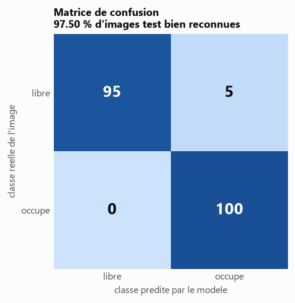
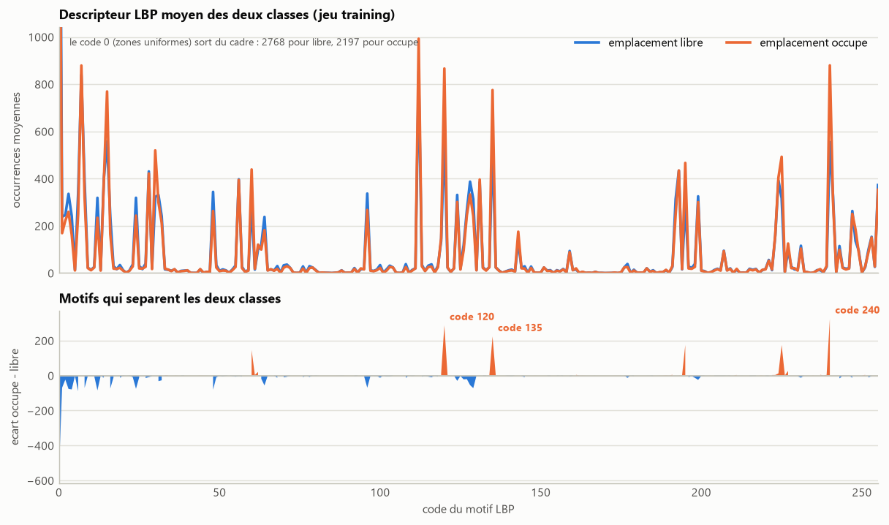

# Classification d'emplacements de parking par descripteur LBP

Determination automatique de l'etat d'un emplacement de parking (libre / occupe)
a partir du descripteur de texture LBP et d'une classification au plus proche
voisin.

## Methode

1. Chaque imagette est convertie en niveaux de gris.
2. Pour chaque pixel hors contours, une fenetre 3x3 code le voisinage en une
   sequence de 8 bits (1 si le voisin est superieur au pixel central), lue en
   spirale horaire depuis le coin superieur gauche.
3. Les occurrences des 256 motifs possibles forment le descripteur de l'image.
4. Chaque descripteur du jeu test est compare aux 200 descripteurs du jeu
   training par somme des differences en valeurs absolues ; l'image recoit le
   label du descripteur le plus proche.


## Resultats

**97,50 % d'images test correctement reconnues** (195 / 200), sur 100
emplacements libres et 100 emplacements occupes tires de la camera A, disjoints
du jeu training.



Les deux classes se distinguent par la quantite de texture : un emplacement vide
est une surface de bitume quasi uniforme, dominee par les motifs plats, alors
qu'un vehicule introduit des contours et des reflets.



Le detail des executions et les fichiers produits sont dans
[`resultats/`](resultats/).

## Donnees

Base CNRPark, extraite a la racine du depot : <http://cnrpark.it/dataset/CNRPark-Patches-150x150.zip>

Arborescence attendue, un dossier par camera :

```
A/
  free/    imagettes d'emplacements libres
  busy/    imagettes d'emplacements occupes
```

## Prerequis

```
pip install -r ../requirements.txt
```

## Utilisation

Generation des descripteurs (`resultats/training.txt` et `resultats/test.txt`,
256 valeurs LBP par ligne suivies du label 0 = libre / 1 = occupe) :

```
python build_dataset.py --train-root ../A
```

Classification du jeu de test et taux de reconnaissance :

```
python classify.py
```

Figures du dossier `resultats/` :

```
python figures.py
```

## Options

```
python build_dataset.py --train-root ../A --test-root ../B   # test sur une autre camera
python build_dataset.py --train-per-class 100 --test-per-class 100 --seed 0
python classify.py --training resultats/training.txt --test resultats/test.txt
```

## Organisation

| Fichier            | Role                                                    |
| ------------------ | ------------------------------------------------------- |
| `lbp.py`           | Calcul du descripteur LBP 3x3 (256 motifs)              |
| `dataset.py`       | Tirage des imagettes, lecture/ecriture des descripteurs |
| `build_dataset.py` | Generation de `training.txt` et `test.txt`              |
| `classify.py`      | Plus proche voisin L1 et taux de reconnaissance         |
| `figures.py`       | Generation des figures                                  |
| `figstyle.py`      | Style commun des figures                                |
