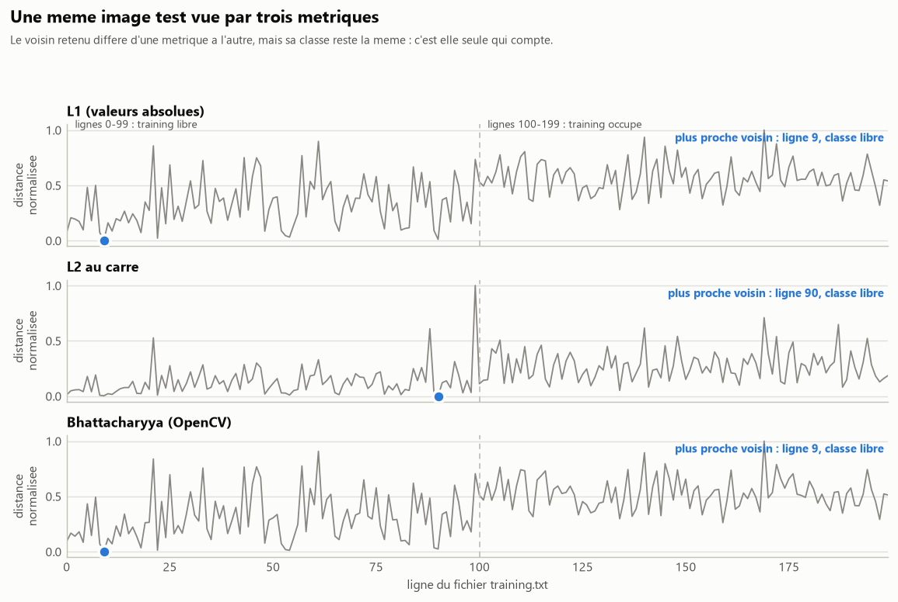
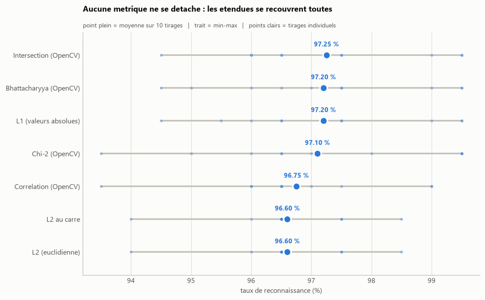

# Comparaison de metriques de distance sur descripteurs LBP

Evaluation de l'influence de la metrique de comparaison d'histogrammes sur le
taux de reconnaissance du classifieur d'emplacements de parking (descripteur LBP
et plus proche voisin). Le protocole est identique d'une metrique a l'autre,
seule la fonction de distance change.

## Metriques evaluees

| Metrique | Implementation | Voisin retenu |
| -------- | -------------- | ------------- |
| L1, somme des differences en valeurs absolues | numpy | minimum |
| L2, distance euclidienne | numpy | minimum |
| L2 au carre | numpy | minimum |
| Bhattacharyya | `cv2.HISTCMP_BHATTACHARYYA` | minimum |
| Chi-2 | `cv2.HISTCMP_CHISQR` | minimum |
| Correlation | `cv2.HISTCMP_CORREL` | **maximum** |
| Intersection | `cv2.HISTCMP_INTERSECT` | **maximum** |

Les deux dernieres sont des mesures de similarite et non de distance : le plus
proche voisin y correspond au score maximal.



## Resultats

Sur un tirage unique, les taux vont de 96,00 % a 98,00 %. Cet ecart n'est pas
significatif : repetee sur 10 tirages aleatoires independants, une meme metrique
varie de 1,51 point en moyenne, soit plus du double des 0,65 point qui separent
la meilleure metrique de la pire.



Aucune metrique ne se detache donc sur ce jeu de donnees. Les deux variantes L2
donnent exactement le meme resultat, ce qui est attendu : la racine carree est
une fonction croissante et ne modifie pas l'ordre des distances, donc pas le
plus proche voisin.

Le detail des executions et les fichiers produits sont dans
[`resultats/`](resultats/).

## Donnees

Base CNRPark, extraite a la racine du depot : <http://cnrpark.it/dataset/CNRPark-Patches-150x150.zip>

```
A/
  free/    imagettes d'emplacements libres
  busy/    imagettes d'emplacements occupes
```

## Prerequis

```
pip install -r ../requirements.txt
```

## Utilisation

```
python build_dataset.py --train-root ../A
python compare.py
```

Evaluation sur plusieurs tirages, puis figures :

```
python benchmark.py
python figures.py
```

## Options

```
python build_dataset.py --train-root ../A --test-root ../B   # test sur une autre camera
python benchmark.py --runs 10 --train-per-class 100 --test-per-class 100
python compare.py --training resultats/training.txt --test resultats/test.txt
```

## Organisation

| Fichier            | Role                                                    |
| ------------------ | ------------------------------------------------------- |
| `lbp.py`           | Calcul du descripteur LBP 3x3 (256 motifs)              |
| `dataset.py`       | Tirage des imagettes, lecture/ecriture des descripteurs |
| `build_dataset.py` | Generation de `training.txt` et `test.txt`              |
| `distances.py`     | Definition des metriques comparees                      |
| `compare.py`       | Classification et tableau comparatif des taux           |
| `benchmark.py`     | Repetition de l'experience sur plusieurs tirages        |
| `figures.py`       | Generation des figures                                  |
| `figstyle.py`      | Style commun des figures                                |
