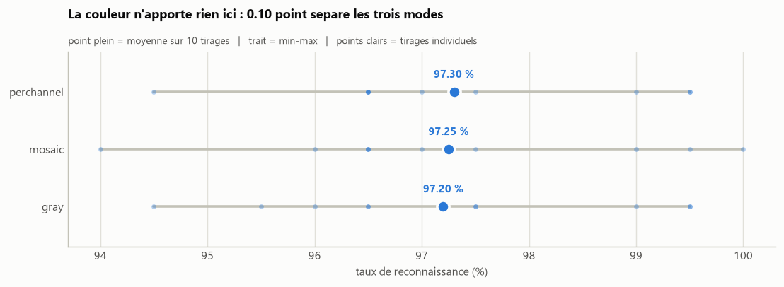
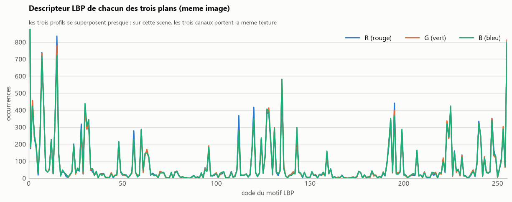

# Descripteur LBP couleur

Extension du classifieur d'emplacements de parking au traitement de la couleur.
Le LBP etant defini sur un canal unique, une image couleur (CV_8UC3) doit
d'abord etre ramenee a des images mono-canal.

## Methode

L'image est separee en ses trois plans R, G et B, chacun etant une image en
niveaux de gris. Ces trois plans sont juxtaposes horizontalement en une seule
image de largeur 3W, sur laquelle un unique LBP est calcule.


Trois strategies sont implementees et comparees :

| Mode | Descripteur | Principe |
| ---- | ----------- | -------- |
| `gray` | 256 valeurs | conversion classique en niveaux de gris (reference) |
| `mosaic` | 256 valeurs | plans R, G, B juxtaposes, un seul LBP sur la mosaique |
| `perchannel` | 768 valeurs | un LBP par plan, histogrammes concatenes |

Sur la mosaique, les deux colonnes de jonction font comparer par la fenetre 3x3
des pixels appartenant a des canaux differents. Ces motifs n'ont pas de sens
physique ; ils representent 2 colonnes sur 448 et restent negligeables. Le mode
`perchannel` traite chaque plan separement et ne presente pas cet artefact.

## Resultats

Les trois modes obtiennent le meme taux sur un tirage unique. Repetee sur 10
tirages independants, l'experience les separe de **0,10 point**, pour une
variation d'un tirage a l'autre de 1,62 point.



La couleur n'apporte donc rien sur ce jeu de donnees, ce que la comparaison des
trois plans explique : sur ces scenes de parking, les trois canaux portent
pratiquement la meme texture, et le LBP ne mesure que la texture.



Le detail des executions et les fichiers produits sont dans
[`resultats/`](resultats/).

## Donnees

Base CNRPark, extraite a la racine du depot : <http://cnrpark.it/dataset/CNRPark-Patches-150x150.zip>

```
A/
  free/    imagettes d'emplacements libres
  busy/    imagettes d'emplacements occupes
```

## Prerequis

```
pip install -r ../requirements.txt
```

## Utilisation

Comparaison des trois strategies sur un meme tirage :

```
python compare_modes.py --train-root ../A
```

Execution d'une seule strategie :

```
python build_dataset.py --mode mosaic --train-root ../A
python classify.py --mode mosaic
```

Evaluation sur plusieurs tirages, puis figures :

```
python benchmark.py
python figures.py
```

## Options

```
python build_dataset.py --mode mosaic --save-mosaic resultats/mosaique.png
python build_dataset.py --mode perchannel --train-root ../A --test-root ../B
python benchmark.py --runs 10 --train-per-class 100 --test-per-class 100
```

## Organisation

| Fichier            | Role                                                    |
| ------------------ | ------------------------------------------------------- |
| `lbp.py`           | Calcul du descripteur LBP 3x3 (256 motifs)              |
| `color.py`         | Separation des plans R, G, B et descripteurs couleur    |
| `dataset.py`       | Tirage des imagettes, lecture/ecriture des descripteurs |
| `build_dataset.py` | Generation de `training.txt` et `test.txt`              |
| `classify.py`      | Plus proche voisin L1 et taux de reconnaissance         |
| `compare_modes.py` | Tableau comparatif des trois strategies                 |
| `benchmark.py`     | Repetition de l'experience sur plusieurs tirages        |
| `figures.py`       | Generation des figures                                  |
| `figstyle.py`      | Style commun des figures                                |
