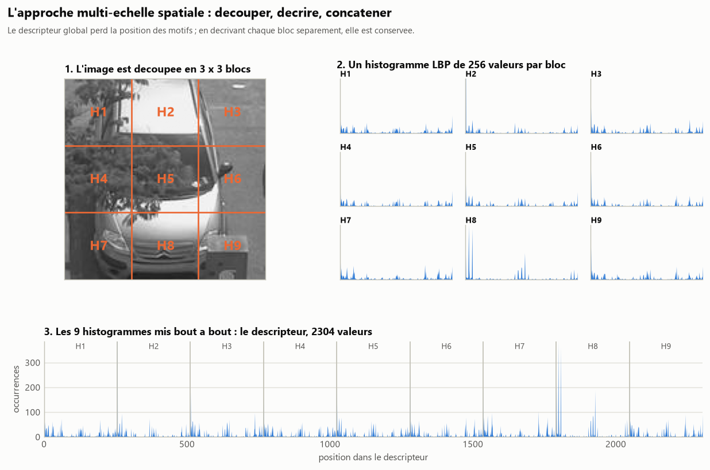
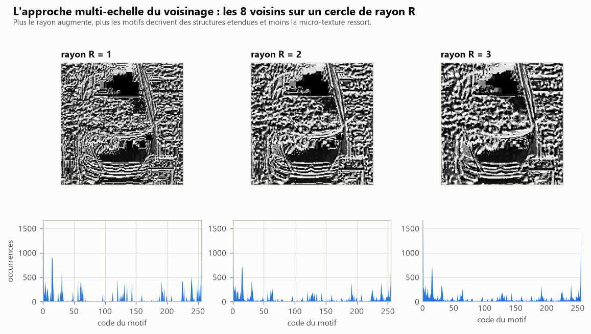
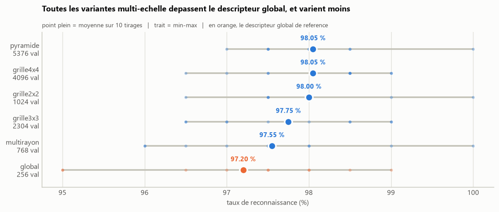
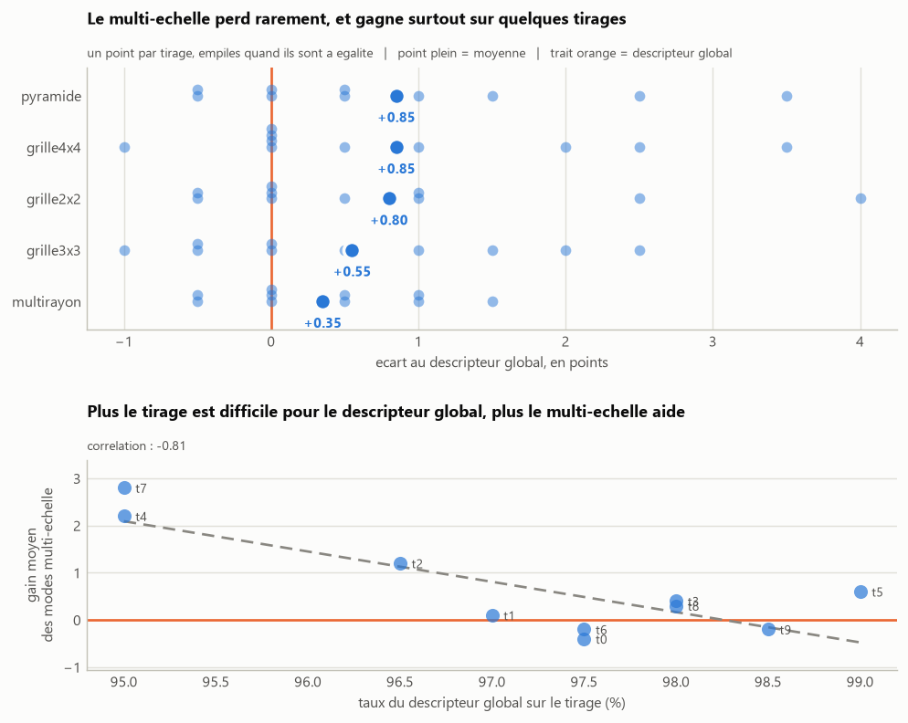

# Descripteur LBP multi-echelle

Le descripteur LBP global compte les occurrences des 256 motifs sur toute
l'image. Ce comptage perd toute information de position : deux images dont les
memes motifs sont repartis differemment produisent le meme descripteur. Une
voiture au centre de l'emplacement et un feuillage dans un coin peuvent ainsi
donner des descripteurs proches.

L'approche multi-echelle attaque cette limite selon deux axes independants.

## Echelle spatiale : decouper, decrire, concatener

L'image est decoupee en une grille de blocs. Un histogramme LBP H1, H2, ... est
calcule sur chaque bloc, puis tous sont concatenes. Le descripteur resultant
conserve la position des motifs. Une grille g x g donne g x g x 256 valeurs.



Le mode `pyramide` combine trois grilles (1x1, 2x2 et 4x4) dans un seul
descripteur, decrivant la scene simultanement en gros et en fin.

## Echelle du voisinage : faire varier le rayon

Au lieu de la fenetre 3x3, les 8 voisins sont pris sur un cercle de rayon R
autour du pixel central, leur valeur etant obtenue par interpolation
bilineaire. Un petit rayon capte la micro-texture, un grand rayon des
structures plus etendues. Le mode `multirayon` concatene les histogrammes
obtenus pour R = 1, 2 et 3.



## Modes implementes

| Mode | Descripteur | Principe |
| ---- | ----------- | -------- |
| `global` | 256 valeurs | descripteur LBP sur l'image entiere (reference) |
| `grille2x2` | 1 024 valeurs | 4 blocs, un histogramme par bloc |
| `grille3x3` | 2 304 valeurs | 9 blocs |
| `grille4x4` | 4 096 valeurs | 16 blocs |
| `pyramide` | 5 376 valeurs | grilles 1x1, 2x2 et 4x4 reunies |
| `multirayon` | 768 valeurs | voisinage circulaire de rayon 1, 2 et 3 |

## Resultats

Sur 10 tirages aleatoires independants, **toutes les variantes multi-echelle
depassent le descripteur global**, et leur taux varie moins d'un tirage a
l'autre : l'ecart-type passe de 1,29 point pour le descripteur global a 0,79
pour la pyramide.



Le gain moyen reste modeste, 0,85 point pour les meilleurs modes. Les modes
etant evalues sur les memes tirages, la comparaison appariee est plus
informative que celle des moyennes : elle montre que le gain n'est pas uniforme
mais concentre sur les tirages ou le descripteur global echoue. La correlation
entre le taux du descripteur global et le gain apporte par le multi-echelle
vaut **-0,81**.



L'apport du multi-echelle est donc moins d'elever le plafond que de rattraper
les cas difficiles, ce qui se traduit par un classifieur plus regulier.

Cette lecture est confirmee par la variante ou le jeu test provient d'une autre
camera, nettement plus difficile : le descripteur global tombe a 61,50 %, alors
que `grille4x4` tient 67,50 %, soit 6 points de mieux.

Le detail des executions et les fichiers produits sont dans
[`resultats/`](resultats/).

## Donnees

Base CNRPark, extraite a la racine du depot : <http://cnrpark.it/dataset/CNRPark-Patches-150x150.zip>

```
A/
  free/    imagettes d'emplacements libres
  busy/    imagettes d'emplacements occupes
```

## Prerequis

```
pip install -r ../requirements.txt
```

## Utilisation

Comparaison de tous les modes sur un meme tirage :

```
python compare_modes.py --train-root ../A
```

Execution d'un seul mode :

```
python build_dataset.py --mode grille3x3 --train-root ../A
python classify.py --mode grille3x3
```

Evaluation sur plusieurs tirages, puis figures :

```
python benchmark.py
python figures.py
```

## Options

```
python compare_modes.py --test-root ../B --out-dir resultats/croise-camera-B
python build_dataset.py --mode pyramide --train-per-class 100 --test-per-class 100
python benchmark.py --runs 10
python figures.py --grille 4            # decoupage illustre en 4x4
```

## Organisation

| Fichier            | Role                                                     |
| ------------------ | -------------------------------------------------------- |
| `lbp.py`           | Calcul du descripteur LBP 3x3 (256 motifs)               |
| `multiscale.py`    | Decoupage en blocs, pyramide, voisinage circulaire       |
| `dataset.py`       | Tirage des imagettes, lecture/ecriture des descripteurs  |
| `build_dataset.py` | Generation de `training.txt` et `test.txt`               |
| `classify.py`      | Plus proche voisin L1 et taux de reconnaissance          |
| `compare_modes.py` | Tableau comparatif de tous les modes                     |
| `benchmark.py`     | Repetition de l'experience sur plusieurs tirages         |
| `figures.py`       | Generation des figures                                   |
| `figstyle.py`      | Style commun des figures                                 |
