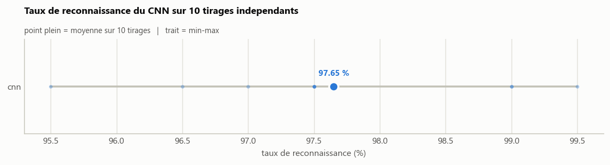
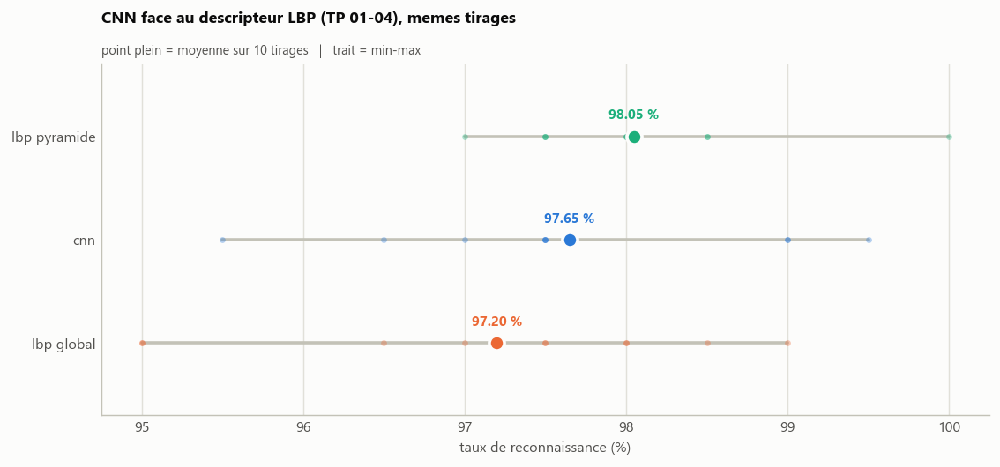
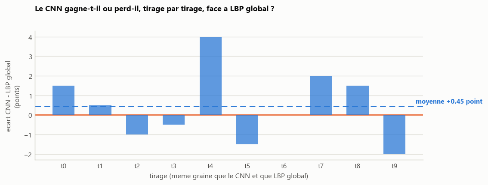
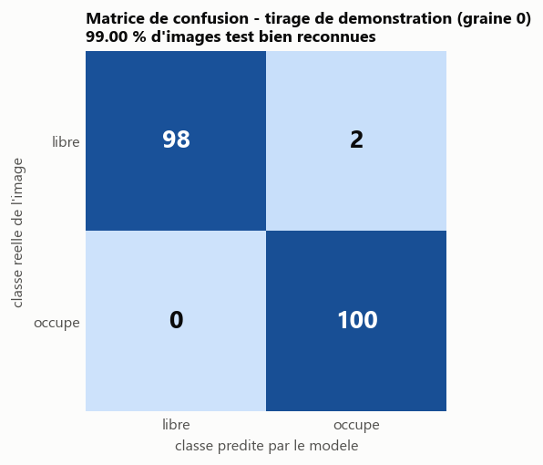

# Classification d'emplacements de parking par CNN

Les TP 01 a 04 determinent l'etat d'un emplacement de parking (libre / occupe)
a partir d'un descripteur de texture fait main (LBP) et d'une classification
au plus proche voisin. Ce TP attaque le meme probleme par apprentissage
profond : un petit CNN, entraine de zero, apprend directement sur les pixels
de l'imagette, sans descripteur intermediaire.

Le notebook [`parking_cnn.ipynb`](parking_cnn.ipynb) est l'artefact principal
de ce dossier (chargement, architecture, entrainement avec courbes,
evaluation, comparaison), sur le meme principe que les notebooks CNN du
depot (`TP_Malware_CNN_Colabnotrunned.ipynb`,
`CNN_Malware_OnOurPythonModel/`). Le dossier reprend par ailleurs
l'organisation des TP 01-04 : un `README.md`, un dossier `resultats/`, et des
modules (`dataset.py`, `figstyle.py`) volontairement dupliques depuis les TP
LBP pour rester autonome.

## Protocole

Identique a celui des TP LBP, pour que les taux restent comparables :

- 100 imagettes libres + 100 occupees pour le training, 100 + 100
  *disjointes* pour le test (camera A du jeu CNRPark).
- L'experience est repetee sur **10 tirages aleatoires independants**, comme
  `04-parking-lbp-multiechelle/benchmark.py`.
- Les graines (`tirage * 2`) sont **les memes** que celles du benchmark LBP
  multi-echelle : chaque tirage pioche exactement les memes 200 + 200
  imagettes des deux cotes. La comparaison au LBP se fait donc a donnees
  strictement identiques, tirage par tirage, et pas seulement en moyenne des
  taux.

## Architecture

Le jeu training ne compte que 200 imagettes : un CNN profond y
sur-apprendrait immediatement. Le reseau (`cnn.py`) est donc volontairement
petit :

```
Rescaling(1/255)
RandomFlip("horizontal") + RandomTranslation(0.05, 0.05)   (entrainement seulement)
Conv2D(16, 3) -> MaxPooling2D(2)
Conv2D(32, 3) -> MaxPooling2D(2)
Conv2D(64, 3) -> MaxPooling2D(2)
Flatten -> Dense(64) -> Dropout(0.5) -> Dense(1, sigmoid)
```

Le training de chaque tirage est lui-meme decoupe (80 / 20, stratifie) pour
l'arret anticipe (`EarlyStopping` sur la perte de validation) ; la mesure
finale se fait sur le jeu test, jamais vu pendant l'entrainement.

## Resultats

**97,65 % de moyenne sur 10 tirages independants** (ecart-type 1,16 point,
de 95,50 % a 99,50 % selon le tirage), CPU seul (pas de GPU necessaire :
quelques secondes par tirage, arret anticipe autour de la 15e-20e epoque).



Le CNN se situe entre les deux resultats LBP : il depasse le descripteur
**global** (97,20 % de moyenne, TP 01/04) de 0,45 point, sans egaler le
meilleur mode **multi-echelle** (pyramide, 98,05 %, TP 04). Les tirages etant
identiques des deux cotes (meme graine, meme images), la comparaison est
appariee et pas seulement une comparaison de moyennes.



La comparaison appariee montre que l'ecart n'est pas uniforme : le CNN gagne
jusqu'a 4 points sur certains tirages et en perd jusqu'a 2 sur d'autres,
sans correlation evidente avec la difficulte du tirage.



Sur le tirage de demonstration (graine 0, cf. le notebook), le CNN atteint
**99,00 %** (198 / 200), avec une seule confusion dans chaque sens :



**A retenir.** Avec seulement 200 imagettes training et un CNN entraine de
zero (sans transfert d'apprentissage), la performance rejoint celle d'un
descripteur fait main deja tres efficace, sans la depasser nettement. Ce
resultat est cite dans la conclusion du notebook et dans
`resultats/conclusion.txt`.

Ces resultats sont regenerables a l'identique :

```
python benchmark.py
python figures.py
```

produit `resultats/benchmark.csv` (taux du CNN sur les 10 tirages) et les
trois figures ci-dessus.

## Donnees

Base CNRPark, extraite a la racine du depot : <http://cnrpark.it/dataset/CNRPark-Patches-150x150.zip>

```
A/
  free/    imagettes d'emplacements libres
  busy/    imagettes d'emplacements occupes
```

## Prerequis

```
pip install -r ../requirements.txt
```

`tensorflow` a ete ajoute a ce fichier pour ce TP ; `numpy`, `opencv-python`
et `matplotlib`, deja necessaires aux TP LBP, sont reutilises tels quels.

## Utilisation

Notebook interactif (recommande, mêmes etapes que ci-dessous mais avec
courbes d'entrainement et matrice de confusion d'un tirage de demonstration) :

```
jupyter notebook parking_cnn.ipynb
```

Ou en ligne de commande, comme les TP LBP :

```
python classify.py                     # un seul tirage (graine 0)
python benchmark.py                    # 10 tirages, resultats/benchmark.csv
python figures.py                      # figures de synthese et de comparaison
```

## Options

```
python classify.py --train-root ../A --test-root ../B   # generalisation a une autre camera
python benchmark.py --runs 10 --epochs 30 --patience 5
python figures.py --lbp-csv ../04-parking-lbp-multiechelle/resultats/benchmark.csv
```

## Organisation

| Fichier            | Role                                                              |
| ------------------ | ------------------------------------------------------------------|
| `dataset.py`       | Tirage des imagettes (copie des TP LBP, memes graines)            |
| `cnn.py`           | Chargement des images, architecture, entrainement/evaluation      |
| `classify.py`      | Un seul tirage, en ligne de commande                              |
| `benchmark.py`     | Repetition sur plusieurs tirages, `resultats/benchmark.csv`       |
| `figures.py`       | Figures de synthese et comparaison au LBP (TP 01-04)              |
| `figstyle.py`      | Style commun des figures (copie des TP LBP)                       |
| `parking_cnn.ipynb`| Notebook principal : execution interactive de bout en bout        |
