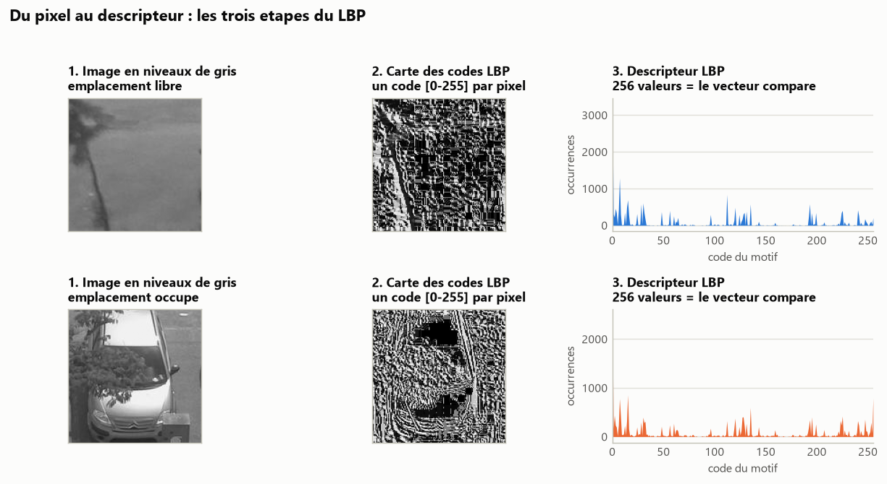
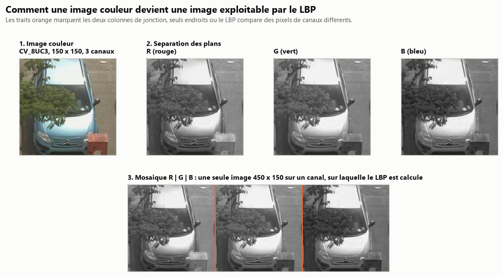

# Caracterisation de scenes : descripteur LBP applique au parking intelligent

Determination automatique de l'etat d'un emplacement de parking (libre ou
occupe) a partir d'images de camera de surveillance, par descripteur de texture
LBP et classification au plus proche voisin.

Le depot regroupe trois etudes successives, chacune dans son repertoire :

| Repertoire | Sujet | Resultat |
| ---------- | ----- | -------- |
| [`01-parking-lbp/`](01-parking-lbp/) | Descripteur LBP et classification au plus proche voisin | **97,50 %** de reconnaissance |
| [`02-parking-distances/`](02-parking-distances/) | Influence de la metrique de comparaison d'histogrammes | 0,65 point separe 7 metriques |
| [`03-parking-lbp-couleur/`](03-parking-lbp-couleur/) | Extension du LBP aux images couleur | 0,10 point separe 3 strategies |

Chaque repertoire est autonome : son `README.md` decrit la methode et les
resultats, son dossier `resultats/` contient les descripteurs generes, le
journal d'execution et les figures.

## 1. Descripteur LBP et classification

Chaque imagette est convertie en niveaux de gris. Pour chaque pixel hors
contours, une fenetre 3x3 code le voisinage en une sequence de 8 bits (1 si le
voisin est superieur au pixel central), lue en spirale horaire. Les occurrences
des 256 motifs possibles forment le descripteur. Une image test recoit le label
du descripteur training le plus proche au sens de la somme des differences en
valeurs absolues.



La carte des codes suffit a comprendre pourquoi la methode fonctionne : un
emplacement vide est une surface quasi uniforme, dominee par les motifs plats,
alors qu'un vehicule introduit contours et reflets.

**97,50 %** des 200 images test sont correctement reconnues. Les 5 erreurs sont
des emplacements libres classes occupes ; aucun vehicule n'est manque. En
entrainant sur la camera A et en testant sur la camera B, le taux tombe a
61,50 % : le descripteur caracterise la texture telle qu'elle apparait sous un
point de vue donne, et ne transfere pas d'une camera a l'autre.

[Detail et figures](01-parking-lbp/)

## 2. Influence de la metrique

Sept metriques sont comparees a protocole constant : L1, L2, L2 au carre, et les
distances d'histogrammes d'OpenCV (Bhattacharyya, Chi-2, correlation,
intersection). Sur un tirage unique, les taux vont de 96,00 % a 98,00 %.

Cet ecart n'est pas significatif. Repetee sur 10 tirages aleatoires
independants, une meme metrique varie de 1,51 point en moyenne, soit plus du
double des 0,65 point qui separent la meilleure metrique de la pire.


Les deux variantes L2 donnent rigoureusement le meme resultat, ce qui est
attendu : la racine carree est croissante et ne modifie pas l'ordre des
distances, donc pas le plus proche voisin.

[Detail et figures](02-parking-distances/)

## 3. Extension a la couleur

Le LBP etant defini sur un canal unique, une image couleur (CV_8UC3) est separee
en ses trois plans R, G et B, juxtaposes horizontalement en une seule image de
largeur 3W sur laquelle un unique LBP est calcule.



Trois strategies sont comparees : niveaux de gris (reference), mosaique, et un
LBP par plan avec histogrammes concatenes. Sur 10 tirages, **0,10 point** les
separe. La couleur n'apporte rien sur ce jeu de donnees, et la comparaison des
plans explique pourquoi : le LBP compare chaque voisin au pixel central, il est
donc invariant aux changements monotones d'intensite. Les trois plans portent la
meme texture locale, meme lorsqu'ils different nettement en luminosite.

[Detail et figures](03-parking-lbp-couleur/)

## Donnees

Base CNRPark, imagettes 150x150 : <http://cnrpark.it/dataset/CNRPark-Patches-150x150.zip>

L'archive est a extraire a la racine du depot, un repertoire par camera :

```
A/
  free/    imagettes d'emplacements libres
  busy/    imagettes d'emplacements occupes
B/
  free/
  busy/
```

Les images ne sont pas versionnees.

## Prerequis

```
pip install -r requirements.txt
```

## Execution

```
cd 01-parking-lbp        && python build_dataset.py && python classify.py
cd 02-parking-distances  && python build_dataset.py && python compare.py
cd 03-parking-lbp-couleur && python compare_modes.py
```

Chaque repertoire dispose en plus d'un `figures.py` regenerant ses figures, et
les deux derniers d'un `benchmark.py` repetant l'experience sur plusieurs
tirages.
